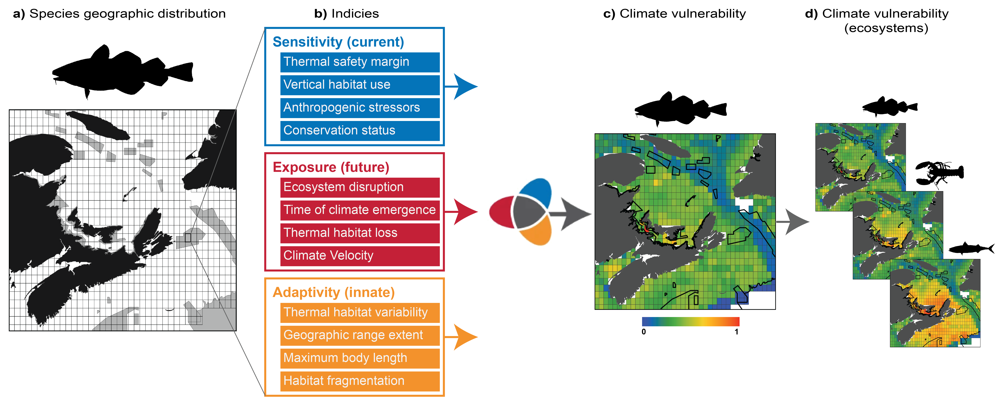
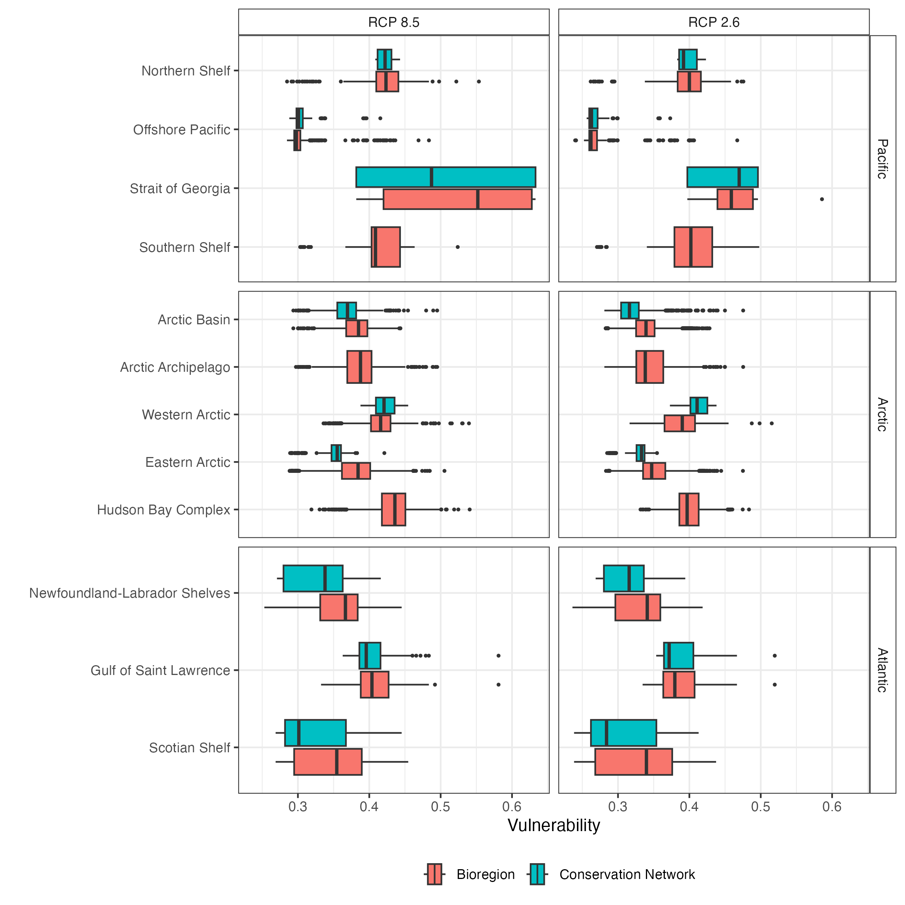
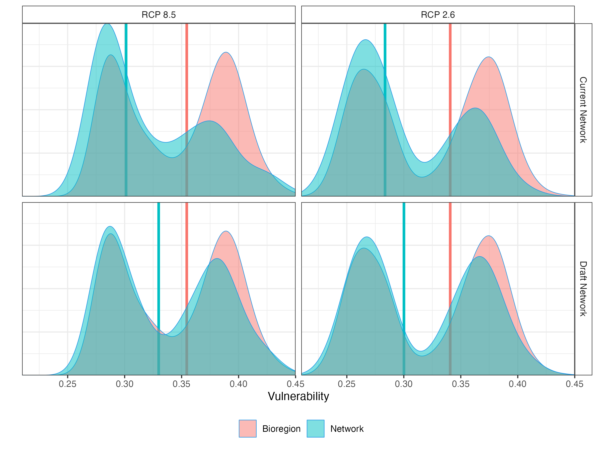

# CAN_MCN_Vulnerability
__Representing Climate Change Vulnerabilities in Canadian Marine Conservation Networks__
Laura Keen, [Christine H. Stortini](https://www.researchgate.net/profile/Christine-Stortini), [Dan G. Boyce](https://www.researchgate.net/profile/Daniel-Boyce-3), [Ryan R.E. Stanley](https://www.researchgate.net/profile/Ryan-Stanley) 

Marine Conservation Areas (MCAs) are key in the global effort to preserve marine biodiversity. To conserve biodiversity amidst climate change, MCAs must be designed in a way that represents a broad spectrum of climate vulnerabilities and risks to protect ecosystems through all spatially-differing climate futures. Applying a recent Climate Risk Index for Biodiversity, we assessed the representativity of climate change vulnerabilities (overlap of vulnerability distributions inside versus outside of MCAs) within the Canadian Marine Conservation Network (CMCN) under two emissions scenarios. Representativity varied from <60% in the Arctic to >85% in the Atlantic ocean, skewed towards lower vulnerabilities, likely due to deeper depths being over-represented in MCAs. Bioregional-scale representativity was highest in the Gulf of Saint Lawrence (93% under low emissions), and lowest in the Eastern Arctic (41% under high emissions). Across the Scotian Shelf-Bay of Fundy bioregion we found that broad-scale representativity targets such as habitat features used to design a draft MCA network inadvertently resulted in high climate risk representativity (>90%). We conclude that designating MCAs in more vulnerable areas (e.g., shallower waters, particularly in the Arctic), and/or prioritizing broad geographic representativity in MCA planning would improve climate risk representativity, supporting a more climate resilient CMCN.

__Figure 1__ Map of the Canadian Exclusive Economic Zone (EEZ) overlaid with (a) outlines of conservation areas (Marine Protected Areas (MPAs), in blue, and Other Effective Conservation Measures (OECMs), in orange), (b) the 14 Canadian bioregions, (c) an aggregate climate vulnerability assessment by [Boyce et al. 2022](https://www.nature.com/articles/s41558-022-01437-y) for the Canadian EEZ under RCP 8.5 (the box on the lower right corner represents the area shown in panel d) and (d) outlines of the Scotian Shelf-Bay of Fundy Draft Conservation Network sites (Areas of Interest (AOIs) in red, draft sites in green, MPAs in blue, and OECMs in orange).

__Figure 2__ Within each 0.5° x 0.5° grid cell across the Canadian geographic distribution of a species (a), 12 standardized climate indices were calculated (b) and used to define the three dimensions of climate vulnerability (c) according to Boyce et al. 2022. These dimensions were used to calculate species’ vulnerability and combined to represent climate vulnerability for ecosystems. Marine Conservation Areas, including MPAs and Marine Refuges, are depicted in each map.

__Figure 3__ Density plots of climate vulnerability distributions for three oceans (Pacific, Arctic, and Atlantic) under two climate scenarios (RCP 8.5 and RCP 2.6) in ocean basins (in red) and within conservation networks (in blue-green). Vulnerabilities are weighted by cell area. Area-weighted medians of distributions are shown as vertical lines in their respective colours. 

__Figure 4__ Box and whisker plots of climate vulnerabilities under high (RCP 8.5) and low (RCP 2.6) emissions subdivided by ocean basin, in entire bioregions (n=12) (in red) and within conservation networks (in blue-green). Vertical lines indicate area-weighted medians and circles represent outliers. Distributions are weighted by area.

__Figure 5__ (a) Representativity of the conservation network in a given bioregion (n=9), expressed as the percent overlap of the distributions of vulnerability in the network compared to the bioregion as a whole. (b) Changes in representativity between high emissions (RCP 8.5) and low emissions (RCP 2.6). Positive values indicate the conservation network will become more representative of bioregional vulnerabilities under RCP 8.5 compared to RCP 2.6. Colours represent weighted median vulnerability of the bioregion under RCP 8.5 and RCP 2.6. Shapes represent emissions scenarios.

__Figure 6__ Density plots of climate vulnerability distributions for the Scotian Shelf-Bay of Fundy for the current network and the draft network under two climate scenarios (RCP 8.5 and RCP 2.6) in the bioregion (in red) and the network (in blue). Vulnerabilities are weighted by cell area. Area-weighted medians of distributions are shown as vertical lines in their respective colours.

__Figure 7__ For Canadian ocean basins (n=3): (a) percentages of depth categories within the conservation network, (b) proportional representation of depth categories within the network where positive values and negative values represent percent over- or under-representation, and vulnerability by depth category under (c) RCP 8.5 and (d) RCP 2.6.